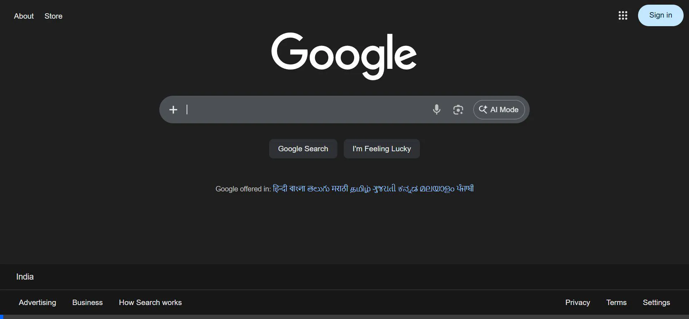

# Professional AI Web Summarizer (Lumina AI)

Lumina AI is a high-performance Chrome extension that provides real-time, professional-grade executive summaries of web content. Powered by the Groq Llama-3 API, it features a premium "editor-style" UI and structured strategic insights.

## Features
- **Real-Time Streaming**: Watch summaries appear live.
- **Executive Formatting**: Professional headers and clear structure (Executive Summary, Key Highlights, Strategic Insight).
- **Fast Execution**: Powered by Groq's high-speed inference engine.
- **Premium Design**: Dark-mode aesthetic with smooth animations.

## Repository Structure
- `backend/`: Python FastAPI server.
- `extension/`: Chrome Extension source code.

## Setup Instructions

### 1. Backend
1. Go to `backend/`.
2. Install dependencies: `pip install -r requirements.txt`.
3. Create a `.env` file with `GROQ_API_KEY=your_key_here`.
4. Run `python main.py`.

### 2. Extension
1. Open `chrome://extensions`.
2. Enable Developer mode.
3. Click "Load unpacked" and select the `extension/` folder.

---
Built with Python, FastAPI, and Vanilla JavaScript.
